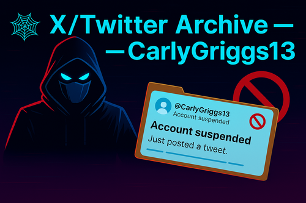
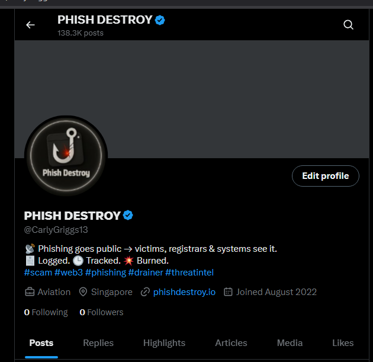
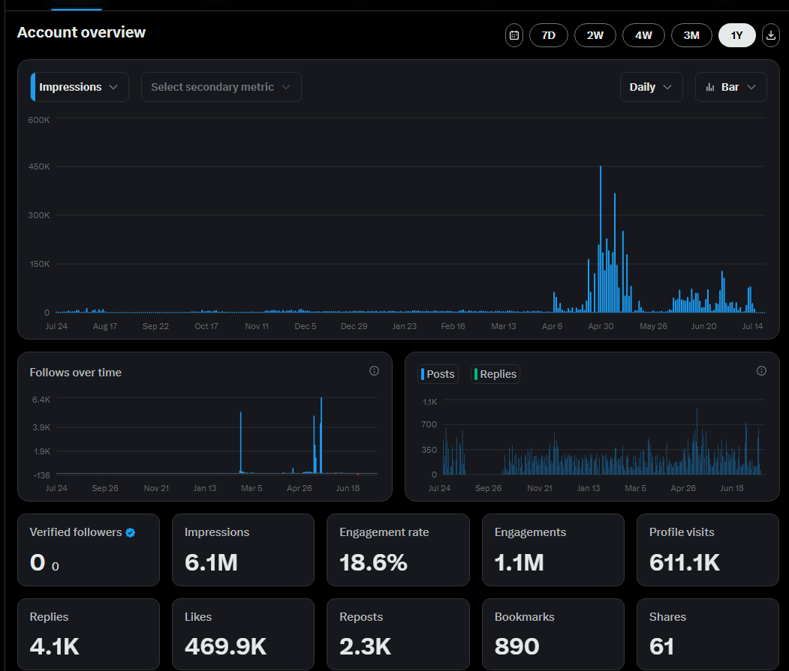

# 🕸️ X/Twitter Archive — CarlyGriggs13

  
  
<strong>138,000+ phishing alerts. Banned by X. Restored here.</strong>

---

##   Account Terminated 

<figure align="center">
  
  <figcaption><i>@CarlyGriggs13 before takedown</i></figcaption>
</figure>

The account was mass-reported and banned by scam networks.  
No export, no appeal, no warning — full data wipe.

-   138,000+ tweets destroyed  
-   2,000–3,000 phishing domains exposed monthly  
-   No recovery, no archive tools  
-   Twitter silently deleted entire feed

<figure align="center">
  
  <figcaption><i>Tweet volume before suspension</i></figcaption>
</figure>

---

  

##   Archive Contents

| File / Folder              | Description                                                  |
|----------------------------|--------------------------------------------------------------|
| `CarlyGriggs13_tweets.csv` | Last 3,500 tweets (structured CSV export)                   |
| `webarchive.json`          | Archived tweet URLs via WebArchive                          |
| `domain.json`              | Parsed phishing domains from tweet content                  |
| `tweetfeed/`               | Raw tweet logs (approx. 1 month)                            |
| `screen.png`               | Screenshot of suspended account                             |
| `screen2.png`              | Screenshot with tweet activity stats                        |
| `img.png`                  | Repo banner image                                           |

---

##   CSV Export

⬇️ [`CarlyGriggs13_tweets.csv`](./CarlyGriggs13_tweets.csv) — structured export of last 3,500 tweets.  
Includes tweet ID, timestamp, body text, and links. Suitable for filtering, analysis, and processing.

---

  

##   Active Threat Channels

Scammer takedowns only remove accounts — not the process.  
Daily threat reports continue across multiple channels:

| Platform   | Feed / URL                                              |
|------------|----------------------------------------------------------|
|   Twitter | [@Phish_Destroy](https://x.com/Phish_Destroy)            |
|   Twitter | [@AmberMille78556](https://x.com/AmberMille78556)        |
|   Telegram| [@PhishDestroyAlerts](https://t.me/PhishDestroyAlerts)   |
|   Mastodon| [@phishdestroy@mastodon.social](https://mastodon.social/@phishdestroy) |
|   Database | [`list.json`](https://github.com/phishdestroy/destroylist/blob/main/list.json) |

  
  

---

##   Message to Scam Networks   

  

You banned a name. We published ten more.  
You think Twitter bans stop takedowns? No.

Phishing sites aren’t blocked because of us.  
They’re blocked because of **your phishing**.  
Our system just makes it happen **faster**.

Taking down our Twitter changes nothing.  
Your scam domains are still getting banned.  
That’s not a threat — that’s a guarantee.

---

##   Legal Notice

- All data is public, OSINT-based, and threat-related only  
- No personal or private information is present  
- This archive is published for research, evidence, and digital preservation

---

  
  &nbsp;&nbsp;&nbsp;&nbsp;&nbsp;
  

  

